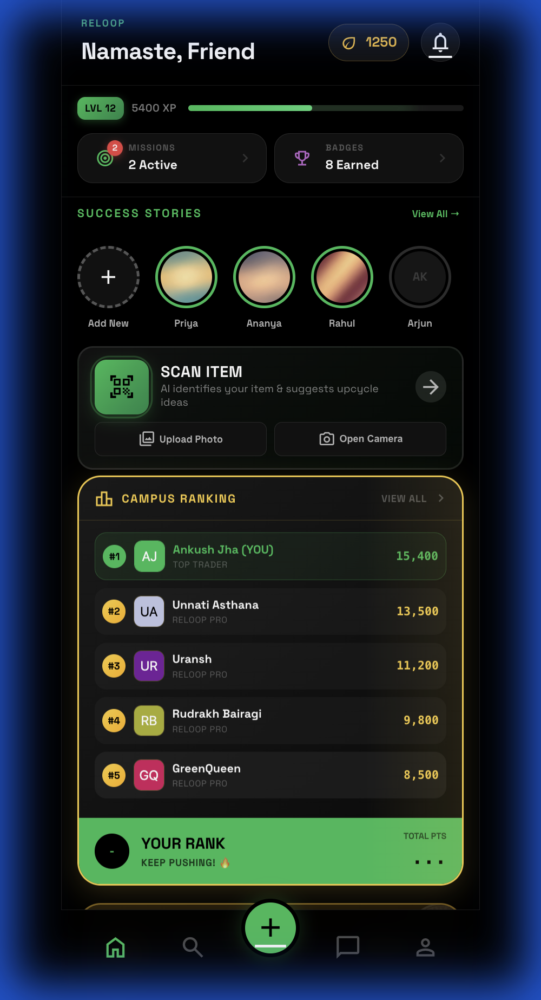
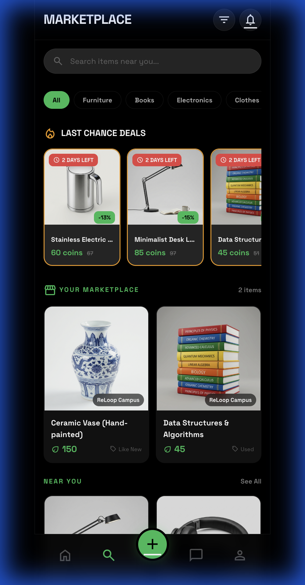
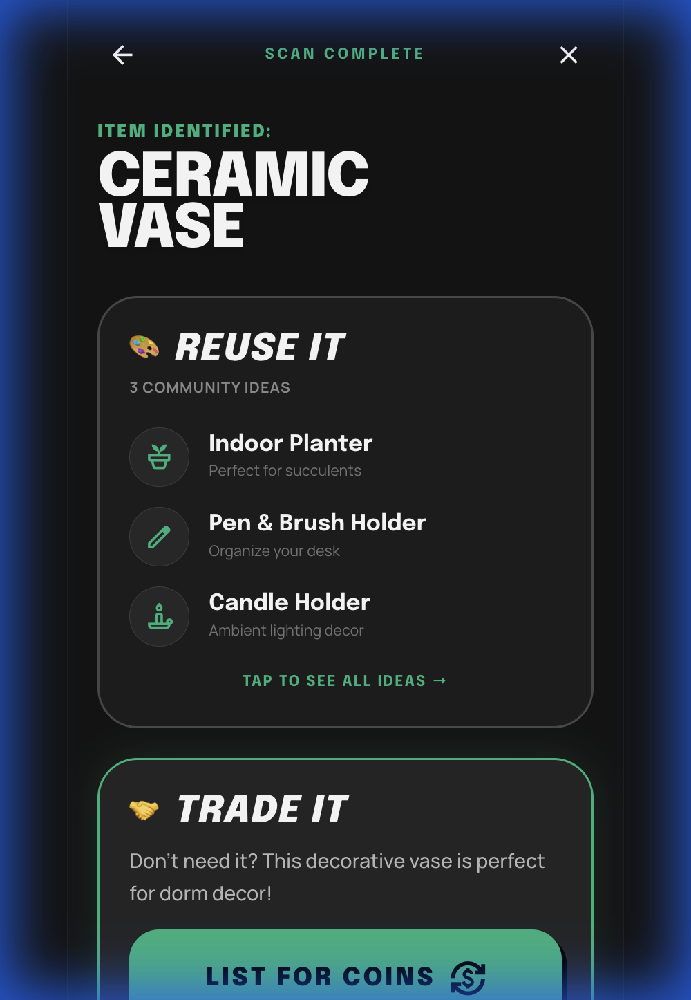
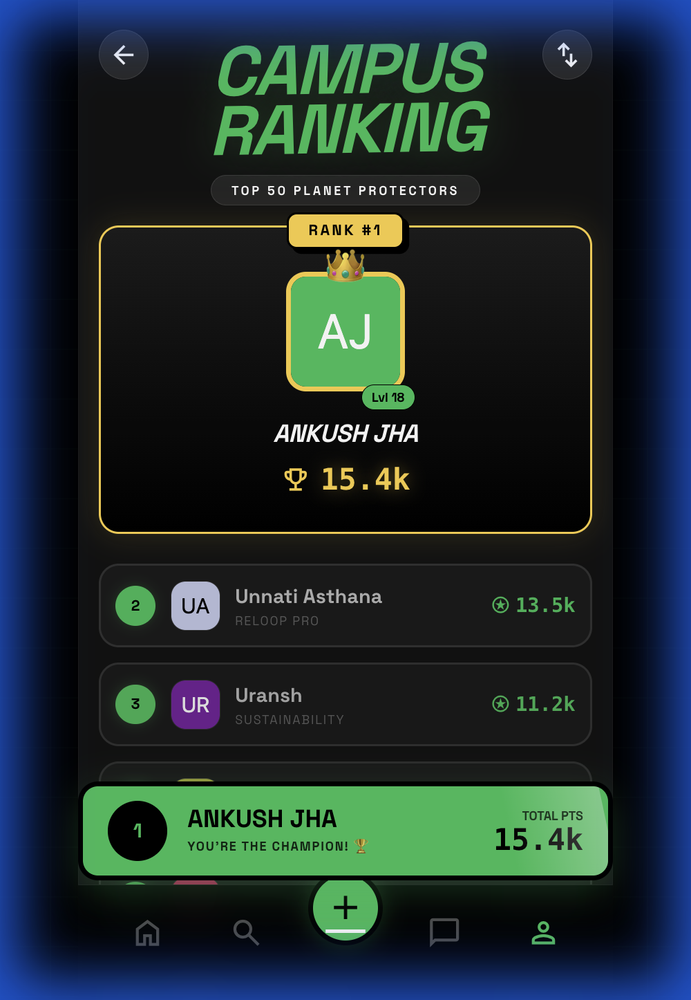
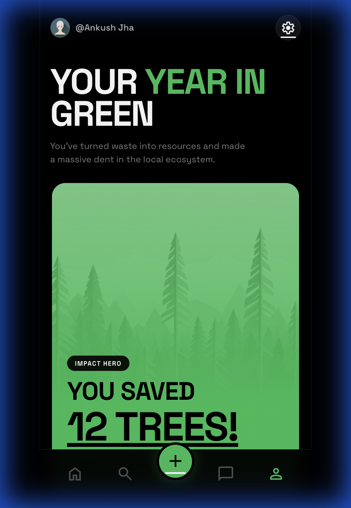
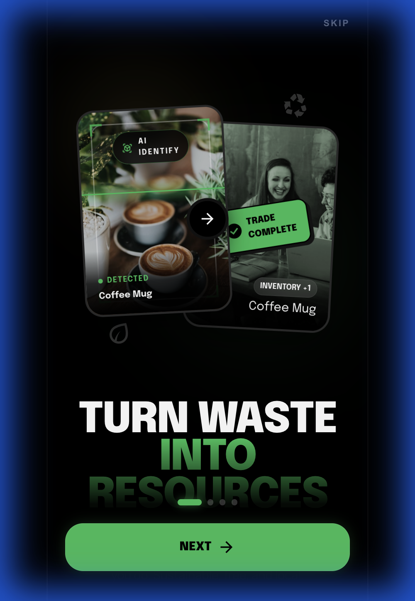

# 🌿 ReLoop - Campus Sustainability Trading App

> A mobile-first web app where college students trade, swap, and recycle items to earn eco-coins and reduce campus waste.

   

---

## 🚀 Key Features

### 🛒 Campus Marketplace
- **Scope-Separated Listings**: Distinct "Your Marketplace" vs "Near You" sections.
- **Smart Filtering**: Filter by Price, Condition, and Category.
- **Efficient Search**: Debounced search for instant results.
- **Lazy Loading**: Optimized image loading for performance.

### 🔍 AI Item Scanner (Powered by Cloudflare Workers AI)
- **Instant Analysis**: Scans items using **Llama 3.2 11B Vision**.
- **Upcycle Ideas**: Generates 3 unique DIY upcycle ideas per item.
- **Resource Links**: Direct links to YouTube and Pinterest for each idea.
- **Eco-Estimates**: Automatically estimates CO2 saved and coin value.

### 🏆 Gamification
- **Daily Missions**: Complete tasks (Scan, Trade, Share) to earn XP.
- **Leveling System**: 20 levels from "Rookie Recycler" to "Eco Master".
- **Dynamic Leaderboard**: Compete on XP and Carbon Saved rankings.
- **Badges**: Unlockable achievements (e.g., "First Trade", "Scanner Pro").

### 📊 Delight Features
- **Eco-Wrapped**: A Spotify-Wrapped style year-in-review for your impact.
- **Social Sharing**: Share your stats and missions natively.

---

## 🛠️ Tech Stack

| Layer | Technology | Usage |
|-------|------------|-------|
| **Frontend** | Vanilla JS, HTML5, CSS3 | Zero-build framework for speed |
| **Backend** | Firebase (Firestore, Auth) | Real-time database & auth |
| **AI** | Cloudflare Workers + Llama | Serverless AI image analysis |
| **Hosting** | Netlify | Fast global CDN hosting |
| **Styling** | Custom CSS Variables | Consistent design system |

---

## 📱 Screenshots

<p align="center">
  
  
  
  
</p>

<p align="center">
  
  
</p>

### 🎬 Demo Walkthrough

<p align="center">
  
</p>

---

## 🏃‍♂️ Quick Start

### Prerequisites
- Node.js & npm (for local dev)
- A Firebase Project (for Database/Auth)
- A Cloudflare Workers Account (for AI)

### Installation

```bash
# 1. Clone the repo
git clone https://github.com/Ankush-Jha/reloop-webapp.git
cd reloop-webapp

# 2. Setup Firebase Config
# Rename js/firebase-config.example.js to js/firebase-config.js
# Add your Firebase credentials

# 3. Serve Locally
npx serve .
# OR
python -m http.server 3000
```

## 📁 Project Structure

```
reloop/
├── 📁 cf-worker/               # Cloudflare Worker AI logic
├── 📁 css/                     # Global styles
├── 📁 js/
│   ├── app.js                  # Main logic
│   └── 📁 services/            # Core Services
│       ├── database.js         # Firestore Wrapper
│       ├── gamification.js     # XP, Levels, Missions Logic
│       └── scanner.js          # AI Integration
├── 📁 pages/
│   ├── 🛒 marketplace/         # Trading Board
│   ├── 🏆 gamification/        # Leaderboard, Missions, Wrapped
│   ├── 🔍 scanner/             # AI Camera & Results
│   └── 👤 user/                # Profile & Settings
└── firestore.rules             # Database Security
```

---

## 👨‍💻 Built By

**Ankush Jha**  
GitHub: [@Ankush-Jha](https://github.com/Ankush-Jha)
**Unnati Asthana**  
**Uransh**  
**Rudraksh Bairagi**  
---

## 📄 License

MIT License - feel free to fork and build upon this!
