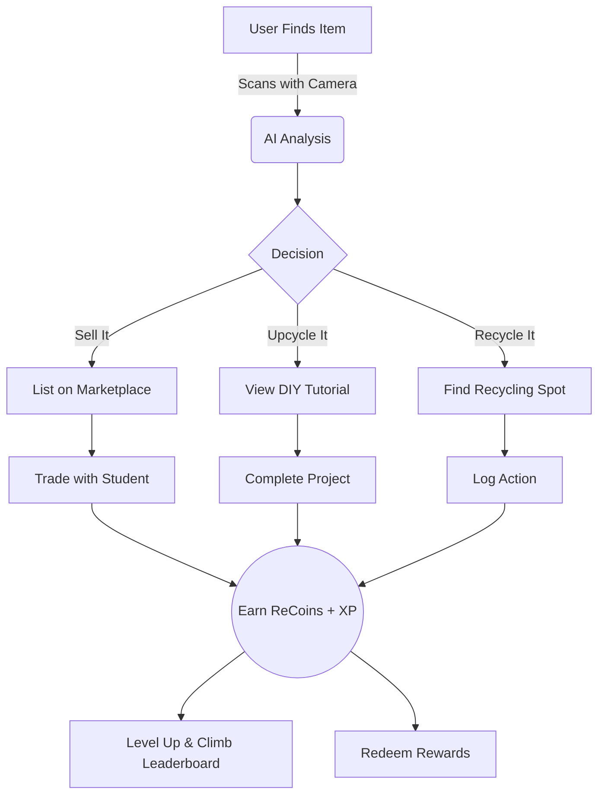

<a name="readme-top"></a>

<div align="center">
  <br />
  <div style="background-color: #4ce68a; width: 80px; height: 80px; border-radius: 50%; display: flex; align-items: center; justify-content: center; margin: 0 auto;">
    <span style="font-size: 40px;">🔄</span>
  </div>
  <h1 align="center">ReLoop</h1>
  <p align="center">
    <strong>Gamified Circular Economy for University Campuses</strong>
    <br />
    Turn waste into value. Scan, Trade, Upcycle.
    <br />
    <br />
    <a href="#live-demo"><strong>View Live Demo »</strong></a>
    <br />
    <br />
    <a href="#key-features">Key Features</a>
    ·
    <a href="#how-it-works">How It Works</a>
    ·
    <a href="#tech-stack">Tech Stack</a>
  </p>
</div>

---

## 🚀 About The Project

**ReLoop** is a hyper-local, gamified marketplace designed to solve the massive waste problem on university campuses. It empowers students to recirculate items instead of throwing them away, using **AI recognition**, **virtual currency (ReCoins)**, and **competitive gamification** to make sustainability effortless and addictive.


### The Problem
Every year, students discard tons of usable furniture, textbooks, and electronics during move-out. Existing solutions are either too broad (Facebook Marketplace) or inconvenient (Recycling centers).

### The Solution
ReLoop closes the loop by providing a trusted, student-only platform where every sustainable action—scanning a bottle, selling a book, or upcycling a shirt—is verified and rewarded.

<p align="right">(<a href="#readme-top">back to top</a>)</p>

---

## ⚡ Key Features

*   **🤖 AI Smart Scanner:** Instantly identify items, estimate their carbon footprint (-CO₂), and get suggestion on whether to Trade, Upcycle, or Recycle.
*   **🛒 Campus Marketplace:** Buy and sell goods using **ReCoins** (no real money required). Support for direct item-for-item swaps.
*   **🌱 Upcycle Hub:** Get AI-generated DIY tutorials (e.g., "Turn this jar into a planter") tailored to the specific item you scanned.
*   **🏆 Gamification:** Earn XP, unlock badges (e.g., "Eco-Warrior"), and compete on campus leaderboards.
*   **📍 Verified Trust:** Students trade safely within their campus network.
*   **🌗 Dark/Light Mode:** Beautiful, accessible UI powered by Tailwind v4.

<p align="right">(<a href="#readme-top">back to top</a>)</p>

---

## 🔄 How It Works

Here is the user journey from finding an item to earning rewards.



<p align="right">(<a href="#readme-top">back to top</a>)</p>

---

## 🛠 Tech Stack

Built with the latest web technologies for speed, scalability, and developer experience.

| Category | Technologies |
|:---|:---|
| **Frontend** |    |
| **Styling** |   |
| **State** |  |
| **PWA** | Progressive Web App capabilities for mobile-native feel |

<p align="right">(<a href="#readme-top">back to top</a>)</p>

---

## 🏁 Getting Started

To run ReLoop locally on your machine, follow these steps.

### Prerequisites
*   Node.js 18+ installed

### Installation

1.  **Clone the repo**
    ```sh
    git clone https://github.com/your-username/reloop.git
    cd reloop/reloop-nextjs
    ```

2.  **Install dependencies**
    ```sh
    npm install
    # or
    yarn install
    # or
    pnpm install
    ```

3.  **Start the development server**
    ```sh
    npm run dev
    ```

4.  **Open in Browser**
    Visit `http://localhost:3000` to see the app in action.

<p align="right">(<a href="#readme-top">back to top</a>)</p>

---

## 📱 Live Demo

Check out the live deployment here:
<!-- Replace with actual link -->
[](https://vercel.com/)

_Note: The app includes a "Demo Mode" toggle in Settings that populates it with realistic mock data, so you can test the full flow without a backend._

<p align="right">(<a href="#readme-top">back to top</a>)</p>

---

## 🤝 Contributing

Contributions are what make the open source community such an amazing place to learn, inspire, and create. Any contributions you make are **greatly appreciated**.

1.  Fork the Project
2.  Create your Feature Branch (`git checkout -b feature/AmazingFeature`)
3.  Commit your Changes (`git commit -m 'Add some AmazingFeature'`)
4.  Push to the Branch (`git push origin feature/AmazingFeature`)
5.  Open a Pull Request

<p align="right">(<a href="#readme-top">back to top</a>)</p>
